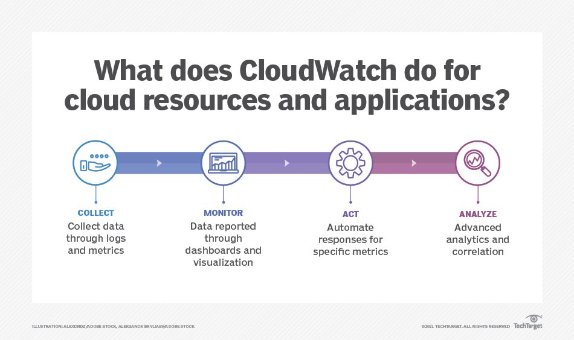

# Laraieb-Imam
CA1
Enterprise Name: Hubspot

<h1>Background</h1>

HubSpot is an American developer and marketer of software products for inbound marketing, sales, and customer service. It is is a CRM platform that offers softwares to manage different kinds of businesses - Marketing Automation Software, Sales CRM Softwares, CMS (Content Management Software), Operations Software, Customer Service Software. Its products and services aim to provide tools for customer relationship management, social media marketing, content management, lead generation, web analytics, search engine optimization, live chat, and customer support. It was founded on "inbound", the notion that people don't want to be interrupted by marketers or harassed by salespeople — they want to be helped. More than 150,000 companies using HubSpot to scale. Current workforce of Hubspot is 5,895. Hubspot's 2021 Revenue was $1.3 Billion.(www.hubspot.com).

<h1>Current IT Setup</h1>

Assuming that Hubspot, CRM company have everything inhouse Network infrastructure, Web servers and Data center.

<b>Hubspot is using 500 Racks specs & price are as follows:</b>

- Head Node Rack Server R640 - $3,019.00*500 = <b>$1,509,500</b>

- Flexible Compute R840 and R6415 - PowerEdge R840 Rack Server - $11,006.50*500 = <b>$5,503,250</b>; PowerEdge R6415 Rack Server - $925*500 = <b>$462,500</b>

- Dense Compute C6420 - $33,693.90*500 = <b>$16,846,500</b>

- Large memory R940 - $12,775.78*500 = <b>$6,387,500</b>

- Accelerated Compute R740 - $7,000.44*500 = <b>$3,500,000</b>

- InfiniBand or OmniPath Network FDR 56Gbps EDR 100Gbps - FDR $ 39.00 – $ 89 * 500 = <b>44,500</b>; EDR $1,035 * 500 = <b>$517,500</b>

- Ethernet Network Z910010/25/40/50/100GbE - $3,420.61*500 = <b>$1,710,000</b>

- SDS Stroage - Dell EMC M3 Series $15,809.00*500 = <b>$7,904,500</b>

- Every 5 years all racks need to be replaced. <b>Total cost of 500 racks setup = $42,675,750</b>

<h1>Cloud Recommendations</h1>

Moving all servers to AWS (Amazon Web Services). Amazon EC2 provide wide section of use cases, since Hubspot is medium entreprise I would suggest m4.large as it is suitable for such scaleable enterprise. Hupspot fits perfectly in this category. EC2 provides a balance of compute, memory and networking resources, and can be used for a variety of diverse workloads. Under <b>m4.large</b> they will get <b>2 vCPU's (Virtual Centralized Processing Unit)</b> which will provide <b>EBS Strorage</b> type with <b>450mbps</b> of dedicated EBS bandwidth.

It will also include <b>8 Gibibytes (GIB) Microsoft Endpoint Manager (MEM)</b>, which is a cloud-based solution built to solve challenges associated with deploying, managing and securing devices in the enterprise, which includes devices servers, PCs and mobile.

Hubspot is data driven company and will required Large storage hence, FSx cluster file storage system will suit the needs of the company. Additionally, <b>Cloud Watch</b> will be an useful tool to include in the package. Cloud watch is a monitoring tool which helps to track the usage of cloud. 

In Summary, recommendation for HubSpot is Quantity of instances (900), Pricing strategy (On-Demand Instances) On Demand since it can be made active whenever needed which will save time and cost usually load balancer handles the traffic and actives EC2 as needed, Storage amount (16 TB), Instance type (m4.large).

<h3>Features of EC2 m4</h3>

- Custom built Amazon Graviton2 Processor with 64-bit Arm Neoverse cores

- Support for Enhanced Networking with Up to 25 Gbps of Network bandwidth

- EBS-optimized by default

- Powered by the Amazon Nitro System, a combination of dedicated hardware and lightweight hypervisor

- Instance storage offered via EBS or NVMe SSDs that are physically attached to the host server (www.aws.amazon.com)

<h3>EC2 m4.large</h3>

EC2 is  Elastic Compute Cloud. It allows users to rent virtual computers on which they run their own computer applications. A user can create, launch, and terminate server-instances as neededand pay by the second for active servers. EC2 provides users with control over the geographical location of instances that allows for latency optimization and high levels of redundancy. 

900 instances will be enough assuming the 30% of the workforce (5,895) will be using the instances . It's a CRM company expected Utilisation rate is assumed to be 80% that will account to 584hours in a month. Hourly rate by AWS is 0.111 USD.

- <b>Price Calculation excluding taxes</b>: 900 instances x 0.111 USD x 584 hours in a month = <b>58,341.60 USD (monthly onDemand cost)</b>

<h3>Amazon Elastic Block Storage (EBS)</h3>

EBS is a block level stroage which is used with EC2 cloud to store data. With EBS data can be stored even after EC2 is shutdown. Hubspot requires a lot of data storage as any CRM company does. 16 TB is recommendated, that is 16384 GB. Price is 0.11 USD per month offered by AWS.

<ul>
  <li><b>Unit conversions</b>: Storage amount: 16 TB x 1024 GB in a TB = 16384 GB</li>
  <li><b>Price Calculation excluding taxes</b>: 16,384 GB x 0.11 USD x 900 instances = <b>1,622,016.00 USD (EBS Storage Monthly Cost)</b> </li>
</ul>

<h3>Cloud Watch</h3>

It is a monitoring tool which helps to track the usage of cloud. The application automatically collects and provides metrics for CPU utilization, latency and request counts. Users can also get additional metrics to be monitored, such as memory usage, transaction volumes or error rates.

It provides current statistics that users can view in graph. Users can set notification to be sent when something being monitored surpasses a specified threshold. The app can also detect and shut down unused or underused EC2 instances. It is offered free of cost by AWS and will work as an important tool.

<h3>Virtual Private Cloud (VPC)</h3>

VPC is virtual network dedicated to user, an isolated section of Amazon Web Services (AWS) Cloud. EC2 can be accessed here with other services. Under VPC few things will be needed by Hubspot like VPN, Data Transfer, Traffic Monitoring, Gateway Load Balancer.

<u>
</ul>

<b>1. VPN -</b> Virtual Private Network enables users to send and receive data across public networks seemlessly as one would do over private network. It also provides access to resources that cannot be accessed on the public network and typically used for remote workers. Virtual Private Network will be a requirement since the client might use it outside Ireland then he will need VPN to access the services.

<ul>
  <li><b>Unit conversions:</b></li>
  
  Average duration for each connection: 24 hours per day * (730 hours in a month / 24 hours in a day) = 730 hours per month
  
  <li><b>Pricing calculations:</b> 900 connnections x 0.05 USD x 730 hours per month = <b>32,850.00 USD (Site to Site VPN usage monthly cost)</b></li>
 
</ul>

<b>2. Data Transfer -</b> It is required because CRM tool has big data size due to customer information and purchase information and other factors so Hubspot needs data transfer option for analysis and projection.

<ul>
  
<li><b>Unit conversions:</b></li>
  
<b>Inbound Internet:</b> 16 TB per month x 1024 GB in a TB = 16384 GB per month

<b>Inbound & Outbound Intra region:</b> 16 TB per month x 1024 GB in a TB = 16384 GB per month

  <li><b>Pricing calculations:</b></li>
  
<b>Inbound:</b>

  <b>Internet:</b> 16384 GB x 0 USD per GB = <b>0.00 USD</b>

  <b>Intra region:</b> (16384 GB x 0.01 USD per GB outbound) + (16384 GB x 0.01 USD per GB inbound) = <b>327.68 USD</b>
</ul>

<ul>
<b>Outbound:</b>

  <b>Internet:</b> Tiered pricing for 16384 GB: 10240 GB x 0.09 USD per GB = <b>921.60 USD</b>

  <b>Intra region:</b> 6144 GB x 0.085 USD per GB = <b>522.24 USD</b>
</ul>

<b>Data Transfer cost (monthly): 1,771.52 USD</b>

<b>3. Traffic Monitoring -</b> It is required because if the account user usage crosses the load the network can handle it will crash so it's required to keep that in check. </b>

900 sessions x 730 hours in a month x 0.018 USD per session-hr = <b>11,826.00 USD</b>

<b>Total Traffic Mirroring charge (monthly): 11,826.00 USD</b>

<b>4. Gateway Load Balancer -</b> Load balancer is required so if the usage increases load balancer will create another instance to handle the traffic.

100 availability zones x 0.014 USD x 730 hours in a month = 1,022.00 USD

<b>Total hourly charges for all Gateway Load Balancers (monthly): 1,022.00 USD</b>  

<b>Last years revenue was $1.3bn. All AWS services would cost $17,27,833 per year assuming a 100% usage, though on the services chosen are Ondemand so prices can be lower. Hence, AWS services are most affordable for Hubspot than setting up everything onsite which costs $42,675,750</b>

<h1>References</h1>
www.hubspot.com. <i>HubSpot | Software, Tools, and Resources to Help Your Business Grow Better</i> [Online] Available at: https.www.hubspot.com [Accessed 1 Dec 2022].

www.hubspot.com. <i>Our Story | HubSpot - Internet Marketing Company</i> [Online]. Available at: https://www.hubspot.com/our-story [Accessed 29 Nov 2022].

www.hubspot.com. <i>158,000 HubSpot Customers and Growing</i> [Online]. Available at: https://www.hubspot.com/customer-spotlight [Accessed 30 Nov 2022]

www.hubspot.com. <i>HubSpot Reports Q4 and Full Year 2021 Results</i> [Online]. Available at: https://ir.hubspot.com/news/hubspot-reports-q4-and-full-year-2021-results [Accessed 01 Dec 2022]

www.aws.amazon.com <i>Secure and resizable cloud compute - Amazon EC2 - Amazon Web Services</i> [Online]. Available at: https://aws.amazon.com/ec2/?nc2=h_ql_prod_fs_ec2 [Accessed 01 Dec 2022]
                      
www.techtarget.com <i>What is Amazon <B>CloudWatch</b></i> [Online]. Available at: https://www.techtarget.com/searchaws/definition/CloudWatch [Accessed 04 Dec 2022]

www.dell.com <i>PowerEdge R640 Rack Server | Dell USA</i> [Online]. Available at: https://www.dell.com/en-us/shop/dell-poweredge-servers/poweredge-r640-rack-server/spd/poweredge-r640/pe_r640_tm_vi_vp_sb [Accessed 10 Dec 2022]

www.dell.com <i>PowerEdge R840 Rack Server | Dell USA</i> [Online]. Available at: https://www.dell.com/en-us/shop/dell-poweredge-servers/poweredge-r840-rack-server/spd/poweredge-r840/pe_r840_12850_vi_vp [Accessed 10 Dec 2022]

www.optcore.net <i>56Gb/s QSFP+Infiniband FDR Passive Direct Attach Copper Cable | Optcore</i> https://www.optcore.net/product/56gbs-qsfp-infiniband-fdr-passive-direct-attach-copper-cable/ [Accessed 10 Dec 2022]

www.dell.com <i>Dell PowerEdge R740 Rack Server: Servers | Dell UK</i> [Online]. Available at: https://www.dell.com/en-uk/shop/productdetailstxn/poweredge-r740 [Accessed 10 Dec 2022]

www.dell.com <i>Dell PowerEdge R940 Rack Server | Dell USA</i> [Online]. Available at: https://www.dell.com/en-us/shop/dell-poweredge-servers/poweredge-r940-rack-server/spd/poweredge-r940/pe_r940_12229_vi_vp [Accessed 10 Dec 2022]

www.avadirect.com <i>Mellanox ConnectX® -5 VP MCX556A-ECAT (2x QSFP28) 100Gbps EDR</i> [Online]. Available at: https://www.avadirect.com/100Gbps-EDR-InfiniBand-or-100Gbps-Ethernet-Network-Adapter-ConnectX-5-VPI-MCX556A-ECAT-2x-QSFP28/Product/10838179 [Accessed 10 Dec 2022]    

www.dell.com <i>PowerEdge R940 Rack Server | Dell USA</i> [Online]. Available at: https://www.dell.com/en-us/shop/productdetailstxn/powervault-me5-series [Accessed 10 Dec 2022]

www.dell.com <i>Dell PowerEdge R740 Rack Server : Servers | Dell UK</i> [Online]. Available at: https://www.dell.com/en-uk/shop/productdetailstxn/poweredge-r740 [Accessed 10 Dec 2022]
