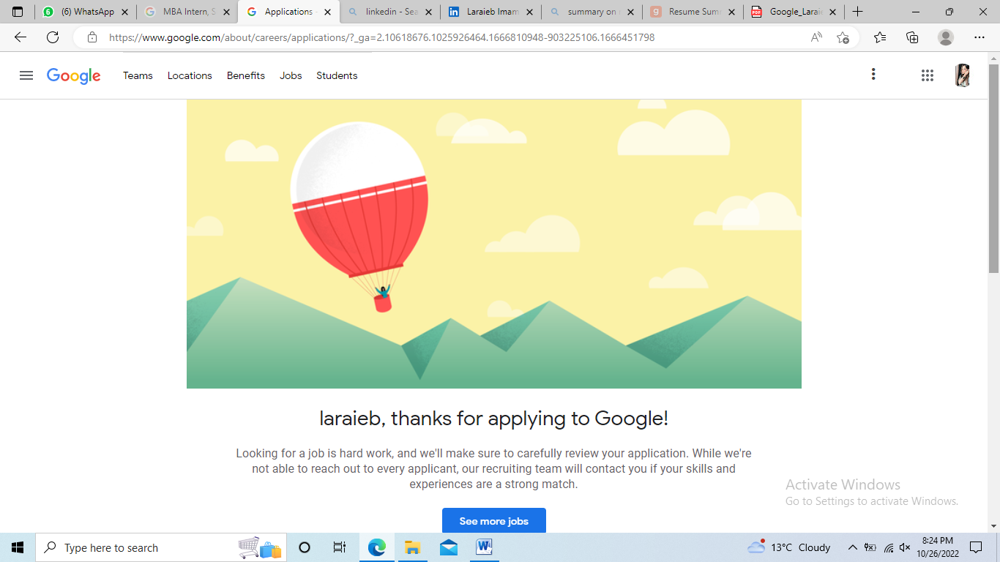

# Laraieb-Imam
CA1
<h1>Enterprise Name: hubspot</h1>

Background

HubSpot is an American developer and marketer of software products for inbound marketing, sales, and customer service. HubSpot was founded in 2006. It is is a CRM platform that offers softwares to manage different kinds of businesses - Marketing Automation Software, Sales CRM Softwares, CMS (Content Management Software), Operations Software, Customer Service Software. Its products and services aim to provide tools for customer relationship management, social media marketing, content management, lead generation, web analytics, search engine optimization, live chat, and customer support.
It was founded on "inbound", the notion that people don't want to be interrupted by marketers or harassed by salespeople — they want to be helped.
Small instance to host crm app.
Cost of AWS nad hubspot combined together -and offered to client . this highly benefits the cliet.
VPC need
Large Storage FSx cluster file system storage system.
ec2 
cloud watch is a monitoring tool to morning how much cloud are they using. where, They wont need their own servers

Current IT Setup

HubSpot supports regional data hosting. Prior to July 2021, HubSpot's AWS (Amazon web services) environment was solely located in the United States. As of July 2021, HubSpot has a new AWS environment in the European Union. HubSpot accounts are hosted in one of these data hosting locations, and customer data is processed and stored in that location.

Recommendations
Amazon EC2 provide wide section of use cases,  since Hubspot is medium entreprise I would suggest M4 as it is suitable for medium enterprise which can be scaled, Hupspot's seems to fit perfectly in this category. It provides a balance of compute, memory and networking resources, and can be used for a variety of diverse workloads. Under M4 Hubspot can select m4.2xlarge Instance where they will get 8 vCPU's which will provide EBS Strorage type with 1000mbps of dedicated EBS bandwidth.

More than 150,000 companies using HubSpot to scale, it's time to celebrate those that inspire us to innovate, to imagine, and to grow better. (find reference if it's true)..

Features

Custom built Amazon Graviton2 Processor with 64-bit Arm Neoverse cores.

Support for Enhanced Networking with Up to 25 Gbps of Network bandwidth.

EBS-optimized by default.

Powered by the Amazon Nitro System, a combination of dedicated hardware and lightweight hypervisor.

Instance storage offered via EBS or NVMe SSDs that are physically attached to the host server.

